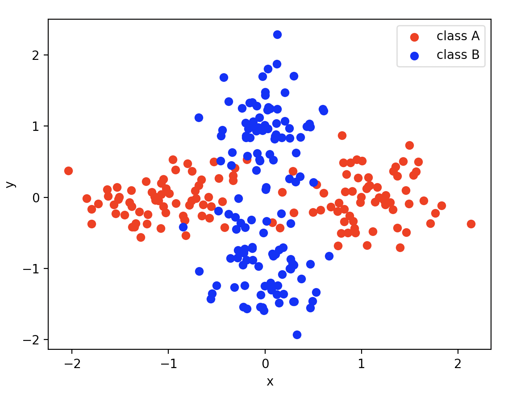

spred tutorial: tasks
---------------------

In this tutorial, we show how to add a new task for evaluating selective
prediction techniques. Specifically, we'll create a task called "normals",
a two-label classification task. Instances for label A are generated from
a mixture of two bivariate normal distributions with means (-1, 0) and (1, 0),
whereas instances for label B are generated from a mixture of two bivariate
normals with means (0, -1) and (0, 1). The covariances are chosen so that most
overlap occurs near the origin, making such points the "most difficult" to 
classify.

